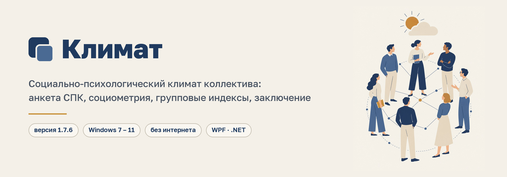
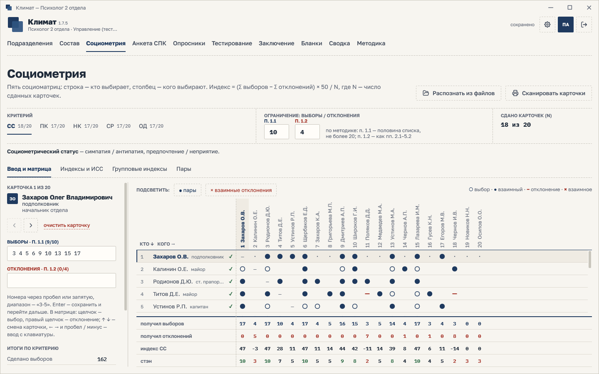
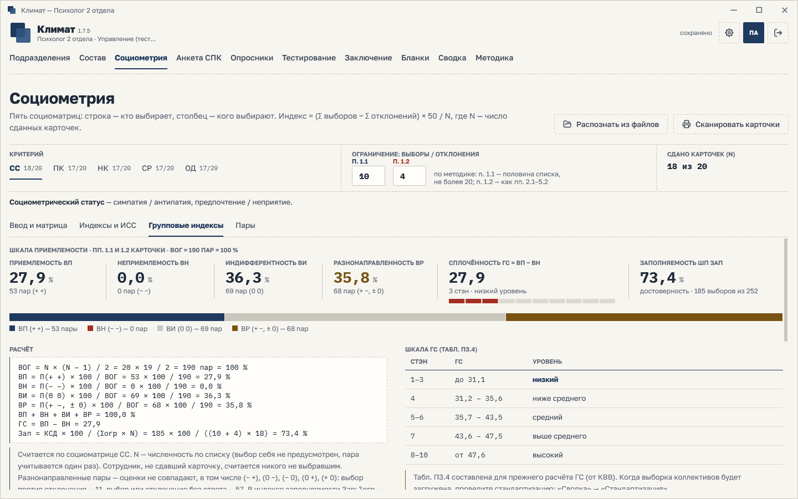
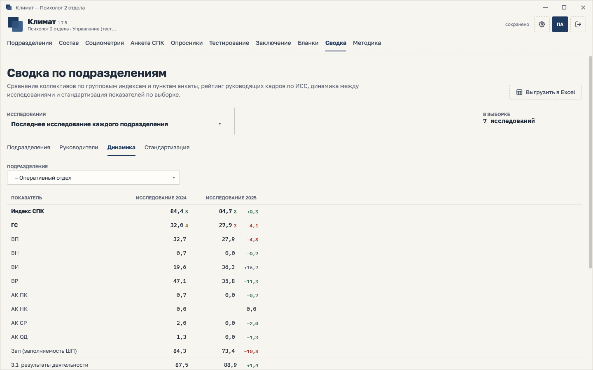
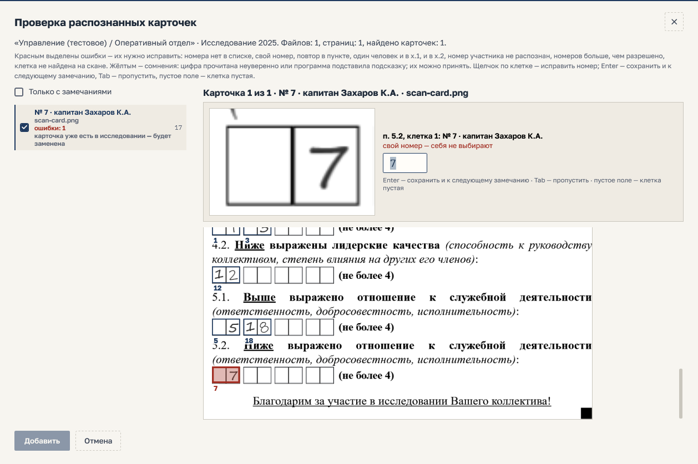

  

  
  
  
  

<h3 align="center"><a href="../../releases/latest">⬇&nbsp; Скачать программу и руководство</a></h3>

  <a href="#установка">Установка</a> ·
  <a href="#активация">Активация</a> ·
  <a href="#что-умеет">Возможности</a> ·
  <a href="#что-нужно-компьютеру">Требования</a>

---

**Климат** — программа психолога для оценки социально-психологического климата служебного коллектива.
Анкета СПК и параметрическая социометрия по пяти критериям: от ввода бланков и карточек — вручную, со сканера
или с экрана — до индексов, групповых показателей, стандартизации по выборке и готового заключения на листах A4.

Программа работает на компьютере без интернета, данные лежат в зашифрованных хранилищах под паролем.
Здесь выкладываются только готовые к установке файлы: исходный код не публикуется.

## Что скачать

Все файлы — в разделе [**Releases**](../../releases/latest).

| Файл | Для чего |
|---|---|
| **`Klimat-Setup-<версия>.exe`** | Windows 10 и 11, 64 бита |
| **`Klimat-Setup-Win7-<версия>.exe`** | Windows 7 SP1, 8.1, 10, 11 — 32 и 64 бита |
| `Klimat-Guide-<версия>.pdf` | руководство пользователя |
| `Klimat-Guide-Win7-<версия>.pdf` | руководство к выпуску для Windows 7 |

> Не знаете, какая у вас Windows, — берите выпуск **для Windows 7**: он работает на всех перечисленных версиях.

## Как выглядит

<table>
  <tr>
    <td width="50%">
       
      <b>Социометрия</b> — карточки вводятся в матрицу, пары и взаимные отклонения подсвечиваются
    </td>
    <td width="50%">
       
      <b>Групповые индексы</b> — расчёт на виду, стэны и расшифровка уровня
    </td>
  </tr>
  <tr>
    <td>
       
      <b>Сводка</b> — сравнение коллективов и динамика между исследованиями
    </td>
    <td>
       
      <b>Распознавание карточек</b> — программа читает рукописные номера, спорные места отдаёт на проверку
    </td>
  </tr>
</table>

## Установка

1. Скачайте установщик из раздела [Releases](../../releases/latest) и запустите его. Он проверит систему
   и, если нужно, подскажет, как установить .NET Framework 4.8, — или поставит его сам, когда пакет встроен в комплект.
2. Выберите папку и для кого ставить: **только для меня** (права администратора не нужны) или **для всех пользователей**.
3. На шаге **Активация** введите серийный номер — как его получить, см. ниже.
4. При первом запуске создайте хранилище и задайте пароль. Отметка **Тестовое хранилище** создаст пример
   с данными (пароль `111111`) — на нём удобно освоиться, ничего не испортив.

Обновление ставится поверх прежней версии: хранилища, пароли и настройки сохраняются, серийный номер
вводить заново не нужно.

## Активация

Программа привязана к компьютеру и работает только с серийным номером, выданным для этого компьютера.

> [!IMPORTANT]
> **Получить серийный номер можно только через администратора.** Создать или подобрать его самостоятельно нельзя.

1. На шаге **Активация** нажмите **Сгенерировать ключ** — появится ключ компьютера из 20 знаков вида
   `XXXXX-XXXXX-XXXXX-XXXXX`. Он считается по материнской плате и не содержит личных данных.
2. Передайте ключ администратору: кнопкой **копировать ключ** — в письмо или сообщение, кнопкой
   **сохранить ключ в файл** — на флешку, или продиктуйте по телефону (букв I, L, O, U в ключе нет,
   ошибку в одном знаке ловит контрольная сумма).
3. Администратор пришлёт серийный номер (108 знаков группами по 6) или файл лицензии.
4. Вставьте номер кнопкой **вставить из буфера** либо откройте файл кнопкой **открыть файл лицензии**
   и нажмите **Далее**.

Если программу перенесли на другой компьютер или заменили материнскую плату, понадобится новый номер —
повторите эти шаги.

## Что умеет

| | |
|---|---|
| 👥 **Социометрия** | матрица выборов и отклонений по пяти критериям, индивидуальные индексы и стэны, согласованность рангов, взаимные пары |
| 📊 **Групповые индексы** | приемлемость, неприемлемость, сплочённость, конфликтность, заполняемость — с расчётом на виду |
| 📋 **Анкета СПК** | ввод бланков щелчками, контроль переходов, индекс СПК со стэнами |
| 📷 **Сканы** | бланки и карточки со сканера или из файлов; рукописные номера читает встроенное распознавание, спорные места — на проверку |
| 📄 **Заключение** | готовый черновик по принятому образцу, правка прямо на листах A4, сохранение в Word и печать |
| 📈 **Сводка** | ранжирование коллективов, рейтинг руководителей, динамика между исследованиями, нормы по выборке |
| 🧠 **Опросники** | библиотека методик со шкалами и ключами, профили участников |
| 💬 **Тестирование на экране** | участник проходит анкету, социометрию и опросники сам, выход — по паролю |
| 🖨 **Бланки** | анкета, регистрационный бланк, социометрическая карточка — в Word и на печать |

## Что нужно компьютеру

- Windows 7 SP1, 8.1, 10 или 11; для основного выпуска — Windows 10 или 11, 64 бита.
- 400 МБ свободного места, экран от 1280×720.
- Интернет не нужен ни для установки, ни для работы.
- Для сканирования бланков — сканер или МФУ с поддержкой WIA; подойдут и фотографии с телефона.

## Вопросы

Вопросы по работе программы, серийные номера и обновления — через администратора, у которого вы получали программу.
Порядок работы шаг за шагом описан в руководстве: оно лежит рядом с установщиком в разделе
[Releases](../../releases/latest).

---

Проприетарное программное обеспечение, все права защищены. На снимках — демонстрационные данные.
